# IT / AV Task Management System — Database Reference
> **หมายเหตุ:** เอกสารนี้ปรับจากระบบใช้งานจริงเพื่อใช้เป็น Portfolio/Demo Template — ชื่อบริษัท สถานที่ และบัญชีผู้ใช้ทั้งหมดเป็นข้อมูลตัวอย่าง


> Database Schema และ Data Dictionary จากฐานข้อมูลจริง  
> ตรวจสอบล่าสุด: 14 สิงหาคม 2569 (2026-08-14)  
> เอกสารนี้ไม่บันทึกข้อมูลระบุตัวบุคคล รหัสผ่าน Hash หรือ Secret

## 1. Database Overview

| รายการ | ค่าปัจจุบัน |
|---|---|
| Database name | `it-av-task-system` |
| Database engine | MariaDB 10.4.32 |
| Default character set | `utf8mb4` |
| Default collation | `utf8mb4_general_ci` |
| Connection library | PHP `mysqli` |
| Connection charset | `utf8mb4` |
| Database timezone | `SYSTEM` |
| จำนวนตาราง | 8 |

ตารางจริง:

1. `users`
2. `tasks`
3. `task_images`
4. `task_activity_logs`
5. `team_problem_options`
6. `login_logs`
7. `auth_remember_tokens`
8. `task_categories`
9. `task_locations`

## 2. ER Diagram

เส้นทึบคือ Foreign Key ที่มีอยู่จริง เส้นประคือความสัมพันธ์เชิง Logic ที่โค้ดใช้งานแต่ฐานข้อมูลไม่ได้บังคับ

```mermaid
erDiagram
    USERS {
        INT id PK
        VARCHAR username
        VARCHAR full_name
        VARCHAR email UK
        VARCHAR password
        VARCHAR department
        VARCHAR role
        TINYINT is_enabled
        TINYINT is_approved
        TINYINT failed_login_attempts
        DATETIME lock_until
        VARCHAR profile_image
        TIMESTAMP created_at
    }

    TASKS {
        INT id PK
        VARCHAR title
        VARCHAR category
        VARCHAR department
        VARCHAR responsible_name
        VARCHAR location
        TEXT work_description
        TEXT work_action
        TEXT problem
        TEXT solution
        VARCHAR status
        DATETIME start_time
        DATETIME finish_time
        TEXT remark
        INT created_by
        TIMESTAMP created_at
        TIMESTAMP updated_at
        TINYINT is_deleted
        TINYINT is_visible
    }

    TASK_IMAGES {
        INT id PK
        INT task_id FK
        VARCHAR file_path
        VARCHAR original_name
        VARCHAR mime_type
        INT file_size
        INT uploaded_by FK
        TIMESTAMP created_at
    }

    TEAM_PROBLEM_OPTIONS {
        INT id PK
        VARCHAR department
        VARCHAR problem_text
        INT created_by
        TIMESTAMP created_at
    }

    LOGIN_LOGS {
        BIGINT id PK
        VARCHAR username
        INT user_id
        VARCHAR ip_address
        VARCHAR browser
        DATETIME login_time
        TINYINT is_success
        VARCHAR failed_reason
    }

    TASK_CATEGORIES {
        INT id PK
        VARCHAR code UK
        VARCHAR display_name
        TINYINT is_enabled
        TINYINT sort_order
    }

    USERS ||--o{ TASK_IMAGES : "uploaded_by (FK)"
    TASKS ||--o{ TASK_IMAGES : "task_id (FK, cascade)"
    USERS ||..o{ TASKS : "created_by (logical)"
    USERS ||..o{ TEAM_PROBLEM_OPTIONS : "created_by (logical)"
    USERS ||..o{ LOGIN_LOGS : "user_id (logical)"
```



`task_categories` ไม่มีความสัมพันธ์กับ `tasks.category` และไม่มี Code Reference ในระบบปัจจุบัน

## 3. Current Aggregate Snapshot

ข้อมูลนี้เป็นจำนวนรวม ไม่แสดงชื่อผู้ใช้ ชื่องาน หรือรายละเอียดภายในงาน

### 3.1 Tasks

| สถานะข้อมูล | จำนวน |
|---|---:|
| Rows ทั้งหมด | 34 |
| Active (`is_deleted = 0`) | 26 |
| Soft deleted (`is_deleted = 1`) | 8 |

Active tasks ตามทีม:

| ทีม | จำนวน |
|---|---:|
| IT | 10 |
| AV | 16 |

Active tasks ตามสถานะ:

| Status | จำนวน |
|---|---:|
| `pending` | 5 |
| `in_progress` | 7 |
| `completed` | 14 |
| `cancelled` | 0 |

Active tasks ตาม Category:

| Category | จำนวน |
|---|---:|
| `Hardware` | 13 |
| `Software` | 3 |
| `Customer` | 6 |
| `-` | 4 |

ช่วงข้อมูล:

| ค่า | วันที่/เวลา |
|---|---|
| Created เก่าสุด | 2026-07-21 14:55:53 |
| Created ล่าสุด | 2026-07-23 08:31:52 |
| Start time เก่าสุด | 2026-07-03 09:00:00 |
| Start time ล่าสุด | 2026-07-31 13:35:00 |

ค่าไม่บังคับใน Active tasks:

| Field | จำนวนที่เป็นค่าว่างหรือ `-` |
|---|---:|
| Category | 4 |
| Location | 0 |
| Problem | 4 |
| Solution | 7 |
| Work Description | 0 |
| Work Action | 0 |
| Remark | 3 |
| Finish Time เป็น `NULL` | 0 |
| Responsible Name | 0 |

### 3.2 Users

| รายการ | จำนวน |
|---|---:|
| Users ทั้งหมด | 3 |
| Enabled | 3 |
| Disabled | 0 |
| Legacy `is_approved = 1` | 3 |
| Legacy `is_approved = 0` | 0 |

ตาม Role:

| Role | จำนวน |
|---|---:|
| ADMIN | 1 |
| SUPER | 0 |
| USER | 2 |

ตามทีม:

| ทีม | จำนวน |
|---|---:|
| IT | 2 |
| AV | 1 |

### 3.3 Supporting tables

| ตาราง | Rows |
|---|---:|
| `login_logs` | 34 |
| `auth_remember_tokens` | 0 |
| `task_activity_logs` | 0 |
| `team_problem_options` | 2 |
| `task_images` | 0 |
| `task_categories` | 3 |

พบไฟล์อยู่ใน `uploads/tasks/` แต่ไม่มี Row ใน `task_images` ปัจจุบัน จึงมีความเป็นไปได้ว่าเป็นไฟล์ค้างหรือไฟล์ที่ถูกสร้างก่อน Database integration

## 4. Data Dictionary: `users`

วัตถุประสงค์:

- เก็บบัญชีผู้ใช้
- Authentication
- Team และ Role
- Enable/Lock state และ Legacy compatibility flag
- Lockout state
- Profile information

Engine/Collation:

```text
InnoDB / utf8mb4_general_ci
```

| Column | Type | Null | Default | Key | ความหมาย/การใช้งาน |
|---|---|---:|---|---|---|
| `id` | `int(11)` | ไม่ | ไม่มี | PK, AI | User ID |
| `username` | `varchar(50)` | ไม่ | ไม่มี | ไม่มี Unique | ชื่อเข้าสู่ระบบ |
| `full_name` | `varchar(120)` | ได้ | `NULL` |  | ชื่อ-นามสกุล |
| `email` | `varchar(150)` | ได้ | `NULL` | UNIQUE | อีเมล |
| `password` | `varchar(255)` | ไม่ | ไม่มี |  | Password Hash |
| `department` | `varchar(20)` | ไม่ | ไม่มี |  | ทีม `IT` หรือ `AV` |
| `role` | `varchar(20)` | ไม่ | ไม่มี |  | `USER`, `SUPER`, `ADMIN` |
| `is_enabled` | `tinyint(1)` | ไม่ | `1` |  | 1 ใช้งาน, 0 ปิดบัญชี |
| `is_approved` | `tinyint(1)` | ไม่ | `1` |  | Legacy compatibility; ระบบสิทธิ์ปัจจุบันไม่ใช้ค่านี้ตัดสินการเข้าถึงงาน |
| `failed_login_attempts` | `tinyint unsigned` | ไม่ | `0` |  | จำนวน Login ผิดสะสมก่อน Lock |
| `lock_until` | `datetime` | ได้ | `NULL` |  | เวลาปลด Lock |
| `profile_image` | `varchar(255)` | ได้ | `NULL` |  | Relative path รูปโปรไฟล์ |
| `created_at` | `timestamp` | ไม่ | Current timestamp |  | วันที่สร้างบัญชี |

Indexes:

| Index | Unique | Columns |
|---|---:|---|
| `PRIMARY` | ใช่ | `id` |
| `uq_users_email` | ใช่ | `email` |

ข้อสังเกต:

- `username` ไม่มี Unique Index แม้โค้ดตรวจชื่อซ้ำก่อนบันทึก
- การตรวจใน Application อย่างเดียวมี Race Condition ได้
- ไม่มี `updated_at`
- ไม่มี `last_login_at` หรือ `last_activity_at`
- “กำลังใช้งาน” ใน Config จึงไม่ใช่ Online Presence จริง

## 5. Data Dictionary: `tasks`

วัตถุประสงค์:

- เก็บงานของทีม IT/AV
- ใช้เป็นแหล่งข้อมูล Dashboard และ Report
- รองรับ Soft Delete

Engine/Collation:

```text
InnoDB / utf8mb4_general_ci
```

| Column | Type | Null | Default | Key | ความหมาย/การใช้งาน |
|---|---|---:|---|---|---|
| `id` | `int(11)` | ไม่ | ไม่มี | PK, AI | Task ID |
| `title` | `varchar(255)` | ไม่ | ไม่มี |  | ชื่องาน |
| `category` | `varchar(50)` | ไม่ | ไม่มี |  | `Hardware`, `Software`, `Customer` หรือ `-` |
| `department` | `varchar(20)` | ไม่ | ไม่มี |  | ทีมเจ้าของงาน |
| `responsible_name` | `varchar(100)` | ได้ | `NULL` |  | ชื่อผู้รับผิดชอบที่แสดง |
| `location` | `varchar(100)` | ไม่ | ไม่มี |  | สถานที่หรือ `-` |
| `work_description` | `text` | ได้ | `NULL` |  | รายละเอียดงาน |
| `work_action` | `text` | ได้ | `NULL` |  | การดำเนินงาน |
| `problem` | `text` | ไม่ | ไม่มี |  | ปัญหาที่พบหรือ `-` |
| `solution` | `text` | ไม่ | ไม่มี |  | วิธีแก้ไขหรือ `-` |
| `status` | `varchar(20)` | ไม่ | ไม่มี |  | สถานะงาน |
| `start_time` | `datetime` | ไม่ | ไม่มี |  | วันและเวลาเริ่มงาน |
| `finish_time` | `datetime` | ได้ | `NULL` |  | วันและเวลาสิ้นสุด |
| `remark` | `text` | ไม่ | ไม่มี |  | หมายเหตุหรือ `-` |
| `created_by` | `int(11)` | ไม่ | ไม่มี | ไม่มี FK | User ID ผู้สร้าง |
| `created_at` | `timestamp` | ไม่ | Current timestamp |  | เวลาสร้าง Row |
| `updated_at` | `timestamp` | ไม่ | Current timestamp |  | เวลาแก้ไขล่าสุด |
| `is_deleted` | `tinyint(1)` | ไม่ | `0` |  | 0 Active, 1 Soft deleted |

Indexes:

| Index | Unique | Columns |
|---|---:|---|
| `PRIMARY` | ใช่ | `id` |

ไม่มี Index สำหรับ:

- `is_deleted`
- `department`
- `status`
- `category`
- `start_time`
- `created_at`
- `created_by`

Query ที่ใช้บ่อย:

```sql
WHERE is_deleted = 0
WHERE department = ?
WHERE status = ?
WHERE category = ?
WHERE start_time BETWEEN ? AND ?
ORDER BY created_at DESC, id DESC
GROUP BY status
GROUP BY category
```

เมื่อข้อมูลมากขึ้นควรออกแบบ Composite Index จาก Query Plan จริง ไม่ควรเพิ่มแบบเดาสุ่ม

ข้อสังเกต:

- `created_by` ไม่มี FK ไป `users.id`
- Config ป้องกันลบ User ที่มี Task ด้วย Application logic
- หากแก้ DB ตรงหรือเกิด Race อาจมี Orphan
- Required text fields หลายช่องใช้ `-` แทนข้อมูลว่าง
- `updated_at` ไม่มี `ON UPDATE CURRENT_TIMESTAMP`; โค้ด Update ต้องระบุเอง
- Dashboard Trend ใช้ `start_time`
- Report Date Filter ใช้ `created_at`
- ความหมายช่วงวันที่จึงไม่เหมือนกัน

## 6. Data Dictionary: `task_images`

วัตถุประสงค์:

- เก็บ Metadata รูปภาพประกอบงาน
- ไฟล์จริงอยู่ใน `uploads/tasks/`

Engine/Collation:

```text
InnoDB / utf8mb4_unicode_ci
```

| Column | Type | Null | Default | Key | ความหมาย |
|---|---|---:|---|---|---|
| `id` | `int(11)` | ไม่ | ไม่มี | PK, AI | Image ID |
| `task_id` | `int(11)` | ไม่ | ไม่มี | FK, INDEX | Task เจ้าของรูป |
| `file_path` | `varchar(255)` | ไม่ | ไม่มี |  | Relative path |
| `original_name` | `varchar(255)` | ไม่ | ไม่มี |  | ชื่อไฟล์เดิม |
| `mime_type` | `varchar(100)` | ไม่ | ไม่มี |  | MIME ที่ตรวจจากไฟล์ |
| `file_size` | `int unsigned` | ไม่ | ไม่มี |  | ขนาด Byte |
| `uploaded_by` | `int(11)` | ไม่ | ไม่มี | FK, INDEX | ผู้ Upload |
| `created_at` | `timestamp` | ไม่ | Current timestamp |  | เวลา Upload |

Indexes:

| Index | Unique | Columns |
|---|---:|---|
| `PRIMARY` | ใช่ | `id` |
| `idx_task_images_task` | ไม่ | `task_id` |
| `idx_task_images_uploader` | ไม่ | `uploaded_by` |

Foreign Keys:

| Constraint | From | To | Delete behavior |
|---|---|---|---|
| `fk_task_images_task` | `task_images.task_id` | `tasks.id` | Cascade |
| `fk_task_images_user` | `task_images.uploaded_by` | `users.id` | Restrict/default |

ข้อสังเกต:

- Task ใช้ Soft Delete จึงไม่ทำให้รูปถูกลบ
- การลบ Row ของ Task แบบ Hard Delete จะ Cascade เฉพาะ DB row ของรูป
- Foreign Key Cascade ไม่ลบไฟล์จริงใน Filesystem
- ต้องมี File cleanup แยกหากทำ Hard Delete ในอนาคต

## 7. Data Dictionary: `team_problem_options`

วัตถุประสงค์:

- จดจำข้อความปัญหาที่ผู้ใช้พิมพ์
- แยก Choice ตามทีม

Engine/Collation:

```text
InnoDB / utf8mb4_unicode_ci
```

| Column | Type | Null | Default | Key | ความหมาย |
|---|---|---:|---|---|---|
| `id` | `int(11)` | ไม่ | ไม่มี | PK, AI | Choice ID |
| `department` | `varchar(20)` | ไม่ | ไม่มี | INDEX | ทีม |
| `problem_text` | `varchar(255)` | ไม่ | ไม่มี | Composite UNIQUE | ข้อความ |
| `created_by` | `int(11)` | ไม่ | ไม่มี | ไม่มี FK | ผู้สร้าง Choice |
| `created_at` | `timestamp` | ไม่ | Current timestamp |  | เวลาสร้าง |

Indexes:

| Index | Unique | Columns |
|---|---:|---|
| `PRIMARY` | ใช่ | `id` |
| `index_team_problem_department` | ไม่ | `department` |
| `unique_team_problem` | ใช่ | `department`, `problem_text` |

ข้อสังเกต:

- ทีมเดียวกันไม่สามารถมีข้อความซ้ำตรงตัว
- Case sensitivity ขึ้นกับ Collation
- `created_by` ไม่มี FK
- Config ลบ User โดยตรวจเฉพาะ Task ไม่ตรวจ Problem Options
- จึงสามารถเกิด Orphan `created_by` ได้

## 8. Data Dictionary: `login_logs`

วัตถุประสงค์:

- บันทึก Login สำเร็จ/ไม่สำเร็จ
- ใช้คำนวณ IP rate limit

Engine/Collation:

```text
InnoDB / utf8mb4_unicode_ci
```

| Column | Type | Null | Default | Key | ความหมาย |
|---|---|---:|---|---|---|
| `id` | `bigint unsigned` | ไม่ | ไม่มี | PK, AI | Log ID |
| `username` | `varchar(50)` | ไม่ | ไม่มี | INDEX | Username ที่ส่งมา |
| `user_id` | `int(11)` | ได้ | `NULL` | INDEX | User ID หากหา Account พบ |
| `ip_address` | `varchar(45)` | ได้ | `NULL` |  | IPv4/IPv6 |
| `browser` | `varchar(255)` | ได้ | `NULL` |  | User-Agent |
| `login_time` | `datetime` | ไม่ | Current timestamp |  | เวลา Login |
| `is_success` | `tinyint(1)` | ไม่ | `0` |  | 1 สำเร็จ, 0 ล้มเหลว |
| `failed_reason` | `varchar(100)` | ได้ | `NULL` |  | สาเหตุเชิงระบบ |

Indexes:

| Index | Unique | Columns |
|---|---:|---|
| `PRIMARY` | ใช่ | `id` |
| `idx_login_logs_username_time` | ไม่ | `username`, `login_time` |
| `idx_login_logs_user_time` | ไม่ | `user_id`, `login_time` |

ค่า `failed_reason` ที่โค้ดใช้:

```text
wrong_password
user_not_found
account_locked
account_disabled
ip_rate_limited
```

ข้อสังเกต:

- ไม่มี Foreign Key ไป `users`
- ไม่มี Retention/Cleanup job
- IP rate-limit Query ใช้ `ip_address`, `is_success`, `login_time`
- แต่ไม่มี Index ที่ขึ้นต้นด้วย `ip_address`
- เมื่อ Log โตขึ้น Query Rate Limit อาจช้า

## 9. Data Dictionary: `task_categories`

วัตถุประสงค์เดิม:

- เก็บ Category ที่ตั้งค่าได้

Engine/Collation:

```text
InnoDB / utf8mb4_general_ci
```

| Column | Type | Null | Default | Key | ความหมาย |
|---|---|---:|---|---|---|
| `id` | `int(11)` | ไม่ | ไม่มี | PK, AI | Category ID |
| `code` | `varchar(50)` | ไม่ | ไม่มี | UNIQUE | Code |
| `display_name` | `varchar(100)` | ไม่ | ไม่มี |  | ชื่อแสดง |
| `is_enabled` | `tinyint(1)` | ไม่ | `1` |  | เปิด/ปิด |
| `sort_order` | `tinyint unsigned` | ไม่ | `0` |  | ลำดับ |

ข้อมูลปัจจุบัน:

| Code | Display | Enabled | Order |
|---|---|---:|---:|
| Hardware | Hardware | 1 | 1 |
| Software | Software | 1 | 2 |
| Customer | Customer | 1 | 3 |

สถานะการใช้งาน:

- ไม่มี Source Code อ้างถึง `task_categories`
- Task Input/Report/Dashboard ใช้ `config/constants.php`
- Category จึงเป็น Static Constants ใน Application ตามข้อกำหนดล่าสุด
- ตารางนี้เป็น Schema ที่เหลือจากแนวคิด Category Management เดิม

ไม่ควรลบตารางหรือข้อมูลโดยไม่วิเคราะห์ผลกระทบและได้รับอนุมัติ

## 10. Application Constants

ไฟล์:

```text
config/constants.php
```

### Departments

```php
["IT", "AV"]
```

### Categories

```php
[
    "Hardware" => "Hardware",
    "Software" => "Software",
    "Customer" => "Customer"
]
```

### Statuses

```php
[
    "pending" => "รอดำเนินการ",
    "in_progress" => "กำลังดำเนินการ",
    "completed" => "เสร็จสิ้น",
    "cancelled" => "ยกเลิก"
]
```

ข้อสังเกต:

- Cancelled ยังอยู่ใน Constants
- หน้า Create และ Report Edit สร้างตัวเลือกใหม่แล้วลบ Cancelled
- Dashboard และ Report Filter มี Logic ซ่อน Cancelled คนละจุด
- ยังไม่ใช่ Single Source of Truth ที่ควบคุม “เปิดใช้งาน/ปิดใช้งาน” ของ Status

## 11. Migration Files

| Migration | หน้าที่ |
|---|---|
| `config/user_status_migration.sql` | เพิ่ม `users.is_enabled` |
| `config/user_registration_migration.sql` | Migration เดิมที่เพิ่ม `is_approved`, Full name, Email และ Unique email; Public Registration ปัจจุบันปิดใช้งาน |
| `config/auth_security_migration.sql` | เพิ่ม Lockout/Profile image และสร้าง `login_logs` |
| `config/task_responsible_name_migration.sql` | เพิ่ม `tasks.responsible_name` |
| `config/task_work_details_migration.sql` | เพิ่ม `work_description`, `work_action` |
| `config/task_images_migration.sql` | ทำ `finish_time` nullable และสร้าง `task_images` |
| `config/team_problem_options_migration.sql` | สร้าง Choice ปัญหาแยกทีม |

ข้อจำกัดของ Migration ปัจจุบัน:

- ไม่มี Migration tracking table
- ไม่มี Version ordering
- ไม่มี Rollback
- Migration บางไฟล์ใช้ `ALTER TABLE ADD COLUMN` โดยไม่มี `IF NOT EXISTS`
- Run ซ้ำอาจ Error
- `task_categories` ไม่มี Migration file ใน Source ที่ตรวจพบ

## 12. Data Ownership และ Scope

Task ownership ปัจจุบันมี 3 ความหมาย:

| Field/Concept | ความหมาย |
|---|---|
| `tasks.department` | ทีมเจ้าของงานและขอบเขต Permission หลัก |
| `tasks.created_by` | บัญชีที่สร้างงาน |
| `tasks.responsible_name` | ชื่อบุคคลที่ใช้แสดงเป็นผู้รับผิดชอบ |

UI ปัจจุบันมักแสดง:

```sql
COALESCE(NULLIF(tasks.responsible_name, ''), users.department, '-')
```

ดังนั้นหากไม่ระบุชื่อผู้รับผิดชอบ ระบบอาจแสดงทีมของผู้สร้าง

Permission แก้ไข/ลบงานใช้ `department` เป็นหลัก ไม่ได้ใช้ `created_by` สำหรับ USER ในโค้ดล่าสุด

## 13. Delete Semantics

### Tasks

Soft Delete:

```sql
UPDATE tasks
SET is_deleted = 1
WHERE id = ?
```

Dashboard/Report ใช้:

```sql
WHERE is_deleted = 0
```

ผล:

- Row งานยังอยู่
- Task images ยังอยู่
- ไม่มีหน้า Restore
- ไม่มี `deleted_at` หรือ `deleted_by`

### Users

Hard Delete:

```sql
DELETE FROM users WHERE id = ?
```

Application ป้องกัน:

- ลบบัญชีตัวเองไม่ได้
- ผู้ใช้ที่มี Task record ลบไม่ได้
- แนะนำให้ Disable แทน

แต่ยังไม่ได้ตรวจ:

- `team_problem_options.created_by`
- `login_logs.user_id`
- ไฟล์ Profile

## 14. Database Risks และข้อเสนอแนะ

### Critical/High

1. Database credential อยู่ใน Source Code
2. `users.username` ไม่มี Unique Index
3. `tasks.created_by` ไม่มี Foreign Key
4. Delete User ตรวจความสัมพันธ์ไม่ครบทุกตาราง

### Medium

1. `tasks` ไม่มี Index รองรับ Dashboard/Report queries
2. `login_logs` ไม่มี Index สำหรับ IP rate limit
3. Collation ไม่เป็นแบบเดียวกัน
4. ไม่มี Migration history
5. `task_categories` ไม่ถูกใช้งานแต่ยังอยู่
6. ใช้ `-` แทน `NULL` ทำให้ Query และ Analytics ซับซ้อน
7. ไม่มี `deleted_at` และ `deleted_by`

### Low/Design

1. Status และ Department เป็น `varchar` ไม่มี DB constraint
2. `updated_at` อัปเดตด้วย Application เท่านั้น
3. ไม่มี Metadata สำหรับ Online presence
4. ไม่มี Notification/Activity Log tables

การเปลี่ยน Schema ในอนาคตต้อง:

- สร้าง Migration แยก
- Backup
- ตรวจข้อมูลเดิม
- ทดสอบ Query plan
- ไม่ลบ Column/Table เดิมโดยไม่ได้รับอนุมัติ

## 15. ตารางที่ยังไม่มีแต่ Requirement เคยกล่าวถึง

ระบบปัจจุบันไม่มี:

- `activity_logs`
- `notifications`
- `password_reset_tokens`
- `email_queue`
- `profile_change_requests`
- `remember_tokens`
- `user_sessions`

ดังนั้นฟีเจอร์เหล่านี้ยังไม่มี Data Layer ที่ครบ:

- Notification bell
- Activity log สำหรับ Create/Update/Delete/Logout/Role change
- Forgot password ผ่าน Email
- Approval การแก้โปรไฟล์ (ไม่ได้อยู่ในขอบเขตระบบปัจจุบัน)
- Online user tracking จริง
- Revoke Remember Me รายอุปกรณ์

## 16. Query Behavior ที่สำคัญ

### Dashboard

- USER เห็นเฉพาะ Team ของบัญชี
- SUPER และ ADMIN เลือก Team หรือดูข้ามทีมได้
- Filter วันที่ใช้ `start_time`
- KPI ใช้ Group by Status
- Recent task ใช้ `created_at DESC, id DESC`
- Insight Group by Category/Problem

### Report

- USER โหลดเฉพาะงานใน Session Team
- SUPER และ ADMIN โหลดและจัดการงานข้ามทีมได้
- `is_approved` ไม่มีผลต่อ Query scope
- Search, Filter และ Pagination ทำฝั่ง Server

### Config

- ทุก Role เปิดหน้าได้และเปลี่ยนรหัสผ่านตนเองได้
- USER/SUPER ไม่ Query หรือแสดง User Management/System Information
- ADMIN โหลด Users, จำนวนผู้ใช้งานล่าสุด และ Task counts ทั้งระบบ

## 17. Data Validation Boundary

Application ตรวจ:

- Team อยู่ใน `IT`, `AV`
- Status อยู่ใน Constants และตัด Cancelled บางหน้า
- Category อยู่ใน Constants หรือ `-`
- Thai Buddhist date parse ได้
- Finish time ไม่ก่อน Start time
- Profile/Task image MIME และขนาด

Database ไม่ได้บังคับค่าทีม/Role/Status ด้วย ENUM, CHECK หรือ Foreign Key

จึงต้องถือว่า:

```text
Application Validation = Primary validation layer
Database Constraints = ยังไม่ครอบคลุม Business rules
```

## 18. แนวทางใช้เอกสารนี้

ก่อนเปลี่ยน Form, Report, Dashboard หรือ Permission:

1. ตรวจ Column ที่เกี่ยวข้อง
2. ตรวจว่าค่าว่างใช้ `NULL`, `""` หรือ `-`
3. ตรวจว่า Date filter อิง `created_at` หรือ `start_time`
4. ตรวจ Team ownership
5. ตรวจ Soft Delete
6. ตรวจ Index/Foreign Key
7. หากเปลี่ยน Schema ให้สร้าง Migration ใหม่

