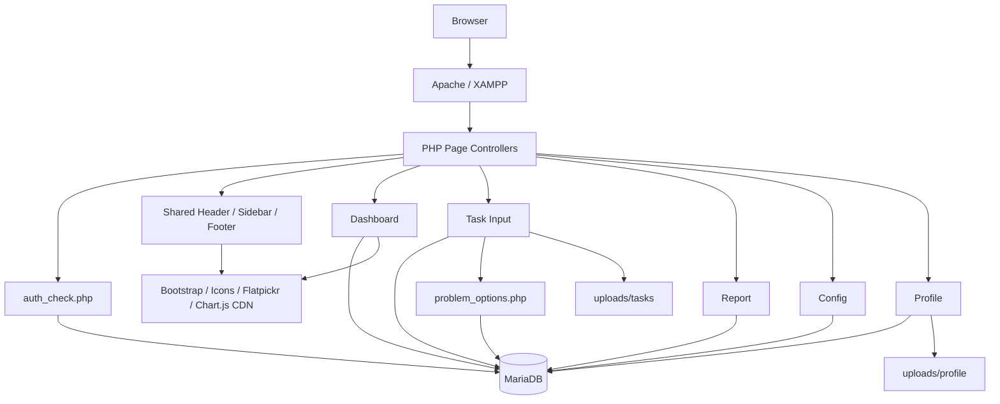
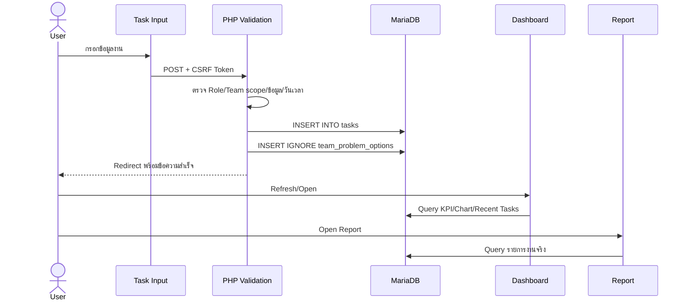

# IT / AV Task Management System — System Overview

> เอกสารอ้างอิงโครงสร้างและสถานะระบบปัจจุบัน  
> ตรวจสอบล่าสุด: 25 กรกฎาคม 2569 (2026-07-25), เขตเวลา Asia/Bangkok  
> สถานะเอกสาร: อ้างอิงจาก Source Code และฐานข้อมูลจริงในเครื่องพัฒนา

## 1. จุดประสงค์ของเอกสาร

เอกสารนี้ช่วยให้นักพัฒนา นักวิเคราะห์ระบบ ผู้ออกแบบ UX/UI และ AI Assistant เข้าใจโครงสร้างปัจจุบันของ **IT / AV Task Management System** ก่อนออกแบบหรือแก้ไขระบบต่อไป

เอกสารชุดนี้แบ่งเป็น 4 ไฟล์:

1. `SYSTEM_OVERVIEW.md` — ภาพรวมระบบ สถาปัตยกรรม Routes และสถานะฟีเจอร์
2. [`UX_UI_GUIDE.md`](UX_UI_GUIDE.md) — หน้าจอ รูปแบบ UI พฤติกรรม UX และ Wireframe
3. [`DATABASE_REFERENCE.md`](DATABASE_REFERENCE.md) — Schema, ER Diagram, Data Dictionary และข้อมูลสถิติโครงสร้าง
4. [`SECURITY_AND_PERMISSIONS.md`](SECURITY_AND_PERMISSIONS.md) — Authentication, Authorization, Permission Matrix และความเสี่ยง

เอกสารไม่บันทึกรหัสผ่าน, Password Hash, Database Password, Remember-Me Secret, Session ID, Cookie Value, Token หรือชื่อไฟล์ Upload จริง

## 2. Executive Summary

ระบบเป็น Web Application ภายในองค์กรสำหรับบันทึก ติดตาม และรายงานงานของทีม IT และ AV ภายในโรงแรม ใช้ PHP แบบ Server-rendered ร่วมกับ MySQL/MariaDB และเพิ่มพฤติกรรมหน้าจอด้วย JavaScript

ฟังก์ชันหลักที่มีอยู่:

- เข้าสู่ระบบสำหรับบัญชีภายในที่ ADMIN สร้างให้
- การสร้างบัญชี กำหนดทีม บทบาท และสถานะโดย ADMIN โดยไม่มีระบบรออนุมัติ
- Dashboard ที่แสดง KPI, กราฟ, ข้อมูลเชิงวิเคราะห์ และงานล่าสุดจากฐานข้อมูลจริง
- หน้าบันทึกงานพร้อมข้อมูลทีม สถานที่ ผู้รับผิดชอบ ปัญหา สถานะ และช่วงเวลา
- ระบบจดจำตัวเลือกปัญหาแยกตามทีม
- หน้ารายงานพร้อมค้นหา ตัวกรอง Pagination ดูรายละเอียด แก้ไข และ Soft Delete
- หน้าจัดการผู้ใช้งานและข้อมูลระบบ
- หน้าโปรไฟล์สำหรับแก้ไขข้อมูลส่วนตัว รหัสผ่าน และรูปโปรไฟล์
- หน้าคู่มือการใช้งาน
- Login Log, Brute-force Protection, CSRF บางส่วน และ Remember Me

ระบบปัจจุบันเป็นลักษณะ “กำลังพัฒนาต่อเนื่อง” มากกว่าระบบ Production ที่ปิดงานแล้ว เนื่องจากยังมี UI ที่ถูกปรับหลังโหลดด้วย JavaScript, Permission บางเส้นทางไม่สอดคล้องกัน, Schema บางส่วนไม่มี Index/Foreign Key และฟีเจอร์ Email, Notification และ Activity Log ยังไม่ครบ

## 3. Technology Stack

| ส่วน | เทคโนโลยี/เวอร์ชันที่ตรวจพบ | วิธีใช้งาน |
|---|---|---|
| Backend | PHP 8.2.12 | PHP แบบ Procedural และ `mysqli` |
| Database | MariaDB 10.4.32 | ฐานข้อมูล `it-av-task-system` |
| Web server | XAMPP / Apache | Project อยู่ใต้ `htdocs` |
| Frontend | Bootstrap 5.3.8 | โหลดจาก jsDelivr CDN |
| Icons | Bootstrap Icons 1.13.1 | โหลดจาก jsDelivr CDN |
| Charts | Chart.js 4.4.8 | ใช้ใน Dashboard |
| Date picker | Flatpickr + `th.js` | วันที่ไทยและปี พ.ศ. |
| JavaScript | Vanilla JavaScript | Modal, Filter, Pagination, Dynamic UI |
| Dependency manager | Composer | มี `dompdf/dompdf` |
| PDF library | Dompdf 3.1.x | ติดตั้งแล้ว แต่ยังไม่ถูกเรียกใช้จากหน้าระบบ |
| Character set | UTF-8 / utf8mb4 | รองรับข้อความภาษาไทย |

ไม่มี React, Vue, Angular หรือ Frontend build pipeline

## 4. ตำแหน่งโปรเจกต์และ Windows Junction

ตำแหน่งที่ใช้งานใน Workspace:

```text
C:\xampp\htdocs\it_task_system
```

ตำแหน่งดังกล่าวเป็น Windows Junction ซึ่งชี้ไปยังโฟลเดอร์จริง:

```text
C:\xampp\htdocs\it-av-task-system
```

ความสัมพันธ์:

```text
it_task_system  ── Junction ──>  it-av-task-system
```

ดังนั้นไฟล์ที่แก้ผ่านชื่อโฟลเดอร์ใดโฟลเดอร์หนึ่งคือไฟล์ชุดเดียวกัน ไม่ใช่สำเนาสองโปรเจกต์

Git repository ตรวจพบที่:

```text
C:\xampp\htdocs\it-av-task-system
```

Branch ปัจจุบัน: `master`

Worktree มีไฟล์แก้ไขและไฟล์ใหม่ที่ยังไม่ได้ Commit หลายรายการ จึงต้องรักษางานเดิมและไม่ใช้คำสั่งที่ล้าง Worktree

## 5. โครงสร้างโปรเจกต์

```text
it-av-task-system/
├── .agents/
├── .vscode/
│   └── launch.json
├── auth/
│   ├── auth_check.php
│   ├── authorization.php
│   ├── login.php
│   ├── logout.php
│   ├── register.php
│   └── workspace.code-workspace
├── config/
│   ├── auth_security_migration.sql
│   ├── constants.php
│   ├── db.php
│   ├── index.php
│   ├── task_images_migration.sql
│   ├── task_responsible_name_migration.sql
│   ├── task_work_details_migration.sql
│   ├── team_problem_options_migration.sql
│   ├── user_registration_migration.sql
│   └── user_status_migration.sql
├── dashboard/
│   └── index.php
├── help/
│   └── index.php
├── includes/
│   ├── app_footer.php
│   ├── app_header.php
│   └── app_sidebar.php
├── profile/
│   └── index.php
├── report/
│   └── index.php
├── task_input/
│   ├── edit.php
│   ├── image_helpers.php
│   ├── index.php
│   ├── problem_options.js
│   └── problem_options.php
├── tools/
│   └── composer.phar
├── uploads/
│   ├── profile/
│   └── tasks/
├── vendor/
├── composer.json
├── composer.lock
└── index.php
```

ไม่แสดงชื่อไฟล์จริงภายใน `uploads/` เพื่อป้องกันการเปิดเผยข้อมูล

## 6. หน้าที่ของไฟล์สำคัญ

### Entry และ Authentication

| ไฟล์ | หน้าที่ |
|---|---|
| `index.php` | Redirect ผู้เข้าชมไป `auth/login.php` |
| `auth/login.php` | Login, Remember Me, Account Lock, IP Rate Limit และ Login Log |
| `auth/register.php` | Endpoint เดิมที่ปิดใช้งานและตอบกลับ HTTP 404 |
| `auth/logout.php` | ล้าง Session, Remember-Me Cookie และกลับหน้า Login |
| `auth/auth_check.php` | Guard หน้าภายในและตรวจสถานะบัญชีซ้ำทุก Request |
| `auth/authorization.php` | Helper สำหรับ Role และ Department scope |

### Shared Application Layout

| ไฟล์ | หน้าที่ |
|---|---|
| `includes/app_header.php` | `<head>`, Shared CSS, Fixed Navbar และข้อมูลโปรไฟล์ |
| `includes/app_sidebar.php` | Sidebar Desktop และ Mobile Offcanvas |
| `includes/app_footer.php` | Bootstrap JS, Flatpickr และการเพิ่มไอคอนคู่มือใน Sidebar |

### หน้าหลัก

| ไฟล์ | หน้าที่ |
|---|---|
| `dashboard/index.php` | KPI, Filter, Charts, Insights, Recent Tasks และ Task Detail Modal |
| `task_input/index.php` | สร้างงานใหม่ |
| `task_input/edit.php` | หน้าแก้ไขงานเดิมแบบแยกหน้า |
| `report/index.php` | รายงาน ค้นหา กรอง Pagination ดู/แก้ไข/ลบงาน |
| `config/index.php` | User Management และ System Information |
| `profile/index.php` | แก้โปรไฟล์ รหัสผ่าน และรูปภาพของบัญชีปัจจุบัน |
| `help/index.php` | คู่มือการใช้งานแบบ Accordion |

### Task Support

| ไฟล์ | หน้าที่ |
|---|---|
| `task_input/problem_options.php` | JSON endpoint เพิ่ม อ่าน และลบตัวเลือกปัญหาแยกตามทีม |
| `task_input/problem_options.js` | UI แบบ Text Input + Choice Memory สำหรับ “ปัญหาที่พบ” |
| `task_input/image_helpers.php` | ตรวจสอบและจัดเก็บรูปภาพประกอบงาน |
| `config/constants.php` | รายการทีม หมวดหมู่ และสถานะที่ใช้ร่วมกันบางหน้า |

## 7. สถาปัตยกรรมปัจจุบัน



รูปแบบทางสถาปัตยกรรม:

- ไม่มี Framework MVC
- แต่ละหน้าเป็นทั้ง Controller, Query Layer และ View ในไฟล์เดียว
- ใช้ `require_once` รวม Authentication, Database และ Layout
- ใช้ Server-rendered HTML แล้วเสริมพฤติกรรมด้วย JavaScript
- บางหน้าใช้ JavaScript สร้าง UI ใหม่ทับ Markup เดิมหลังโหลด
- ไม่มี Service Layer, Repository Layer หรือ Router กลาง

## 8. Route Map

| URL/Route | Method หลัก | ต้อง Login | หน้าที่ |
|---|---:|---:|---|
| `/` | GET | ไม่ | Redirect ไป Login |
| `/auth/login.php` | GET, POST | ไม่ | เข้าสู่ระบบ |
| `/auth/register.php` | GET, POST | ไม่ | ปิดใช้งานและตอบกลับ HTTP 404 |
| `/auth/logout.php` | POST | ใช่ | ออกจากระบบ |
| `/dashboard/` | GET | ใช่ | ภาพรวมระบบ |
| `/task_input/` | GET, POST | ใช่ | สร้างงาน |
| `/task_input/edit.php?id={id}` | GET, POST | ใช่ | แก้ไขงานแบบแยกหน้า |
| `/task_input/problem_options.php` | GET, POST | ใช่ | JSON endpoint สำหรับตัวเลือกปัญหา |
| `/report/` | GET, POST | ใช่ | รายงาน ดู แก้ไข และลบงาน |
| `/report/?edit={id}` | GET | ใช่ | เปิด Report และเปิด Edit Modal ของงาน |
| `/config/` | GET, POST | ใช่ | ทุก Role เปลี่ยนรหัสผ่านตนเอง; ADMIN จัดการผู้ใช้และดูข้อมูลระบบ |
| `/profile/` | GET, POST | ใช่ | ข้อมูลส่วนตัว |
| `/help/` | GET | ใช่ | คู่มือ |

ระบบใช้ Relative Path เช่น `../dashboard/` และไม่มี Central Router

## 9. Shared Layout

หน้าที่ใช้ Shared Layout โดยตรง:

- Task Input
- Task Edit
- Report
- Config
- Profile
- Help

Dashboard มี Navbar และ Sidebar ของตัวเองอยู่ใน `dashboard/index.php` แล้วโหลด `app_footer.php` เพิ่มภายหลัง จึงไม่ได้ใช้โครงสร้าง Shared Header/Sidebar แบบเดียวกับหน้าอื่นอย่างสมบูรณ์

Layout หลัก:

```text
┌──────────────────────────────────────────────────────────┐
│ Fixed Navbar: Brand | Profile | Logout                  │
├───────────────┬──────────────────────────────────────────┤
│ Fixed Sidebar │ Main Content                             │
│ 260px         │                                          │
│               │                                          │
└───────────────┴──────────────────────────────────────────┘
```

Desktop:

- Navbar สูง 72px
- Sidebar กว้าง 260px
- Sidebar fixed และ scroll ภายในได้
- Main Content เว้นด้านซ้าย 260px

Mobile:

- Navbar สูง 64px
- Sidebar เปลี่ยนเป็น Bootstrap Offcanvas
- ซ่อนรายละเอียดชื่อผู้ใช้บางส่วน

ดูรายละเอียดสี ขนาด Card และ Wireframe ใน [`UX_UI_GUIDE.md`](UX_UI_GUIDE.md)

## 10. Application Modules

### 10.1 Authentication และ Account Provisioning

- Login ด้วย Username/Password
- `password_verify()` ตรวจรหัสผ่าน
- Session ID ถูก regenerate หลัง Login สำเร็จ
- Remember Me อายุ 30 วัน ใช้ Signed Cookie
- ไม่มีหน้า Create Account หรือ Self-registration ที่ Login
- `/auth/register.php` ปิดใช้งานและตอบกลับ HTTP 404
- ADMIN สร้างบัญชีจาก Config พร้อมกำหนด Username, ชื่อ, รหัสผ่านเริ่มต้น, Team, Role และสถานะ
- ไม่มี Approval queue; คอลัมน์ `is_approved` คงไว้เพื่อรองรับโครงสร้างฐานข้อมูลเดิม แต่ไม่ใช้ตัดสินสิทธิ์งาน
- บัญชีที่ `is_enabled = 0` หรือยังถูก Lock จะไม่สามารถ Login หรือใช้ Session เดิมต่อได้

### 10.2 Dashboard

- Filter ด้วยช่วงวันที่ ทีม สถานะ และประเภทปัญหา
- ADMIN เลือกทีมได้
- บทบาทอื่นถูกจำกัดตามทีมจาก Session
- KPI 4 ใบ:
  - งานทั้งหมด
  - รอดำเนินการ
  - กำลังดำเนินการ
  - เสร็จสิ้น
- Donut Chart แสดงสัดส่วนสถานะ
- Bar Chart แสดงสถิติวัน/สัปดาห์/เดือน/ปี
- ประเภทงานที่พบมาก
- ปัญหาที่พบบ่อย
- คลิก Insight แล้วเปิดรายการงานใน Modal
- งานล่าสุด 5 รายการต่อหน้า
- คลิกงานเพื่อเปิดรายละเอียด
- ลิงก์แก้ไขจาก Dashboard ไป `task_input/edit.php`

### 10.3 Task Input

- บันทึกงานใหม่เข้า `tasks`
- บังคับ:
  - ชื่องาน
  - ทีม
  - สถานะ
  - วันและเวลาเริ่ม
- ค่าไม่บังคับที่ว่างถูกแปลงเป็น `-` หลายช่อง
- USER ใช้ทีมจาก Session
- SUPER และ ADMIN เลือกทีมได้
- ชื่องานมี Datalist จากงานเดิมของทีม
- สถานที่:
  - เมฆา1
  - เมฆา2
  - เมฆา3
  - วารินทร์
  - พิมาน
  - อื่นๆ
- ผู้รับผิดชอบมีค่าเริ่มต้นจากชื่อเต็มหรือ Username
- สถานะไม่มี “ยกเลิก” ในหน้าเพิ่มงาน
- เมื่อเลือก Completed และไม่ระบุเวลาสิ้นสุด ระบบเติมเวลาปัจจุบัน
- “ปัญหาที่พบ” เป็น Text Input ที่จำ Choice แยกตามทีม
- หน้า Create เรียก Image Helper แต่ไม่มี `<input type="file">` ใน UI ปัจจุบัน

### 10.4 Report

- โหลด Task ที่มองเห็นได้จากฐานข้อมูล
- KPI 4 ใบ
- Search จากชื่องานพร้อม Datalist
- Filter:
  - วันที่เริ่มต้น
  - วันที่สิ้นสุด
  - ทีม
  - สถานะ
  - ประเภทปัญหา
- Pagination และ Rows per page ทำงานใน Browser
- ตารางสุดท้ายหลัง JavaScript:
  - ลำดับ
  - วันที่สร้าง
  - ชื่องาน
  - ทีม
  - สถานะ
  - ผู้รับผิดชอบ
  - การจัดการ
- ดูรายละเอียดผ่าน Modal
- แก้ไขผ่าน Reusable Edit Modal ในหน้า Report
- Soft Delete โดยตั้ง `is_deleted = 1`
- รองรับ Query จาก Dashboard เช่น `status`, `department`, `category` และช่วงวันที่
- รองรับ `?edit={id}` เพื่อเปิด Edit Modal อัตโนมัติ

### 10.5 Config

- ทุกบัญชีที่ Login เปิดหน้าได้
- ทุก Role เปลี่ยนรหัสผ่านตนเองได้โดยยืนยันรหัสผ่านเดิม
- เฉพาะ ADMIN เห็นและใช้งาน User Management กับข้อมูลระบบ
- User Management:
  - ดูผู้ใช้
  - สร้างบัญชีและกำหนดรหัสผ่านเริ่มต้น
  - แก้ Username
  - เปลี่ยน Team
  - เปลี่ยน Role
  - เปลี่ยนรหัสผ่าน
  - เปิด/ปิดบัญชี
  - ลบบัญชีที่ไม่มีประวัติงาน
- System Information:
  - Version
  - จำนวนผู้ใช้ที่กำลังใช้งานตาม Session ปัจจุบัน
  - จำนวนงานทั้งหมด
  - สถานะการเชื่อมต่อฐานข้อมูล
- Card สถิติบางรายการถูกสร้างใน PHP แล้วลบออกด้วย JavaScript

### 10.6 Profile

- ผู้ใช้แก้ข้อมูลของตนเอง:
  - ชื่อ-นามสกุล
  - อีเมล
  - รูปโปรไฟล์
  - รหัสผ่าน
- Username, Team และ Role เป็น Readonly
- เปลี่ยนรหัสผ่านต้องยืนยันรหัสผ่านปัจจุบัน
- รูปโปรไฟล์รองรับ JPG, PNG, WebP ขนาดไม่เกิน 2 MB
- การเปลี่ยนชื่อ/อีเมล/รูปทำงานทันที ยังไม่มี Approval Workflow

### 10.7 Help

- หน้าแนะนำวัตถุประสงค์คู่มือ
- Shortcut ไป Dashboard, Task Input, Report และ Config
- Accordion แยกบทตามหน้า
- มี JavaScript เพิ่มรายละเอียดคู่มือภายหลัง
- เนื้อหาบางส่วนยังอธิบายพฤติกรรมเก่าที่ไม่ตรงกับหน้าปัจจุบันทั้งหมด

## 11. Task Data Flow



เมื่อแก้ไขงานใน Report:

```text
Report Edit Modal
  → POST report/index.php
  → ตรวจสิทธิ์ฝั่ง Server
  → UPDATE tasks
  → Redirect report/?updated=1
```

เมื่อลบงาน:

```text
Report Delete
  → UPDATE tasks SET is_deleted = 1
  → งานถูกซ่อนจาก Dashboard และ Report
```

## 12. Shared Constants และคำศัพท์

### Teams

```text
IT
AV
```

### Roles

```text
USER
SUPER
ADMIN
```

### Active Task Statuses

| Database value | Display |
|---|---|
| `pending` | รอดำเนินการ |
| `in_progress` | กำลังดำเนินการ |
| `completed` | เสร็จสิ้น |

`cancelled` ยังอยู่ใน `config/constants.php` แต่ถูกซ่อนจากหน้าสร้างงานและ UI หลายจุด

### Categories

```text
Hardware
Software
Customer
```

ระบบยังอนุญาต `-` สำหรับงานที่ไม่ได้ระบุ Category

## 13. Feature Readiness

| ฟีเจอร์ | สถานะ | หมายเหตุ |
|---|---|---|
| Login | พร้อมใช้แบบมีข้อควรปรับ | มี Lockout, CSRF, Remember Me |
| Public Registration | ปิดใช้งาน | บัญชีสร้างโดย ADMIN จาก Config เท่านั้น |
| Account Provisioning | พร้อมใช้ | ADMIN กำหนดทีม/Role/สถานะตั้งแต่สร้างบัญชี |
| Dashboard KPI | พร้อมใช้ | Real database |
| Dashboard Charts | พร้อมใช้ | Chart.js, Server data |
| Dashboard Filter | พร้อมใช้ | Server-side |
| Dashboard Recent Tasks | พร้อมใช้ | Server pagination |
| Task Create | พร้อมใช้ | UI ลดรูปแล้ว |
| Team Problem Choices | พร้อมใช้ | เพิ่ม/ลบแยกทีม |
| Task Edit ใน Report | ใช้ได้บางส่วน | Modal เลื่อนเนื้อหาไม่ได้ในบางขนาดหน้าจอ |
| Task Edit แยกหน้า | พร้อมใช้แต่ซ้ำซ้อน | ยังมี `task_input/edit.php` |
| Task Delete | ใช้ได้แต่มีความเสี่ยง | Soft Delete แต่ Delete Form ไม่มี CSRF |
| Report Search/Filter | พร้อมใช้กับข้อมูลปริมาณน้อย | Client-side |
| Report Pagination | พร้อมใช้กับข้อมูลปริมาณน้อย | Client-side |
| Profile | พร้อมใช้ | ไม่มี Approval Workflow |
| Profile Picture | พร้อมใช้ | ไม่มีการลบรูปเก่า |
| Task Picture Upload | ใช้ได้บางส่วน | หน้า Edit มี UI; หน้า Create ไม่มี |
| Config Password Change | พร้อมใช้ทุก Role | ต้องยืนยันรหัสผ่านปัจจุบัน |
| Config User Management | พร้อมใช้สำหรับ ADMIN | USER/SUPER ไม่เห็นส่วนจัดการบัญชี |
| Help | พร้อมใช้ | อธิบาย Workflow และสิทธิ์ตามระบบปัจจุบัน |
| PDF Export | ยังไม่ใช้งาน | มี Dompdf แต่ไม่มี Integration |
| Excel Export | ยังไม่มี | ไม่มี Library/Endpoint |
| Email | ยังไม่มี | ไม่มี Mail Integration |
| Notification Bell | ยังไม่มี | ไม่มี Table/UI/Endpoint |
| Full Activity Log | ยังไม่มี | มีเฉพาะ Login Log |
| Password Reset Email | ยังไม่มี | ADMIN reset ได้จาก Config |

## 14. ข้อจำกัดและ Technical Debt หลัก

### โครงสร้าง

- หน้าใหญ่หลายหน้าเก็บ Query, Logic, HTML, CSS และ JavaScript ในไฟล์เดียว
- Dashboard ไม่ใช้ Shared Header/Sidebar เต็มรูปแบบ
- UI บางส่วนถูกแก้หรือสร้างใหม่ด้วย JavaScript หลังหน้าโหลด
- Constants, Labels และ Permission Rules ยังไม่ได้รวมเป็น Single Source of Truth อย่างสมบูรณ์
- มีหน้าแก้ไขงาน 2 รูปแบบ: Report Modal และ `task_input/edit.php`

### ข้อมูล

- `task_categories` มีอยู่ในฐานข้อมูลแต่ไม่มี Code Reference
- Category ในหน้า Create ปัจจุบันเป็น `-`
- ตารางหลักขาด Index สำหรับ Query ที่ใช้บ่อย
- `tasks.created_by` ไม่มี Foreign Key
- Collation ของตารางไม่เป็นแบบเดียวกันทั้งหมด

### UX/UI

- ภาษาอังกฤษและไทยผสมตามหน้าต่างๆ
- Markup เริ่มต้นกับ UI หลัง JavaScript ทำงานไม่ตรงกันบางหน้า
- Report โหลด Detail Modal และ Delete Modal ตามจำนวนงานทุกแถว
- Report Pagination ไม่ลดภาระ Query ฝั่ง Server
- Help บางข้อความไม่ตรงกับ Permission และ Form ปัจจุบัน

### Security

ดูรายละเอียดทั้งหมดใน [`SECURITY_AND_PERMISSIONS.md`](SECURITY_AND_PERMISSIONS.md)

## 15. กฎการพัฒนาที่ต้องรักษา

ตามข้อกำหนดโครงการ:

- ห้าม Rewrite ระบบใหม่ทั้งหมด
- ห้ามเปลี่ยนโครงสร้างโปรเจกต์ ชื่อไฟล์ หรือชื่อโฟลเดอร์โดยไม่จำเป็น
- ห้ามเปลี่ยน Framework หรือ Theme หลัก
- ห้ามเปลี่ยน Navbar, Sidebar และ Flow หลักโดยพลการ
- ใช้ Database เดิมให้มากที่สุด
- หากต้องเปลี่ยน Schema ให้สร้าง SQL Migration แยก
- ห้ามลบข้อมูลเดิม
- แก้เฉพาะไฟล์ที่เกี่ยวข้อง
- ก่อนแก้ต้องวิเคราะห์ อธิบายผลกระทบ และขออนุมัติ
- หากกระทบมากกว่า 3 ไฟล์ต้องแจ้งผู้ใช้ก่อน
- ไม่สร้าง Dummy Data เว้นแต่ผู้ใช้ร้องขออย่างชัดเจน

## 16. วิธีใช้เอกสารชุดนี้กับ ChatGPT

เมื่อต้องการออกแบบระบบหรือ UI ใหม่ ให้แนบเอกสารทั้ง 4 ไฟล์และระบุว่า:

```text
เอกสารทั้ง 4 ไฟล์อธิบายระบบปัจจุบันจาก Source Code และ Database จริง
กรุณาแยก Current State ออกจาก Proposed Design
อย่า Rewrite ระบบหรือเปลี่ยนโครงสร้างโดยไม่ได้รับอนุญาต
ก่อนเสนอการแก้ไข ให้ตรวจ Permission และ Known Risks ใน
SECURITY_AND_PERMISSIONS.md และ Schema ใน DATABASE_REFERENCE.md
```

สำหรับงาน UX/UI ให้ใช้ [`UX_UI_GUIDE.md`](UX_UI_GUIDE.md) เป็น Current UI Baseline ไม่ควรสมมุติว่า UI ที่อธิบายคือ Target Design สุดท้าย

## 17. ขอบเขตการตรวจสอบ

ตรวจสอบแล้ว:

- Source files ทั้งหมดนอก `vendor`
- PHP routes และ POST handlers
- Shared layout
- JavaScript interactions
- Database schema จริง
- Index และ Foreign Key จริง
- จำนวนข้อมูลแบบ Aggregate
- Authentication และ Permission logic
- PHP Syntax ทั้งโครงการ

ข้อจำกัด:

- ไม่มี In-app Browser เชื่อมต่อในขณะตรวจ จึงไม่ได้เก็บ Screenshot จากหน้า Render จริง
- Wireframe และ UI description อ้างอิงจาก HTML, CSS และ JavaScript ปัจจุบัน
- ไม่ทดสอบการส่งอีเมล เพราะยังไม่มีระบบ Email
- ไม่ทำ Penetration Test และไม่แก้ข้อมูลจริง

ผลตรวจ PHP:

```text
PHP_LINT_OK: 21 files
```

