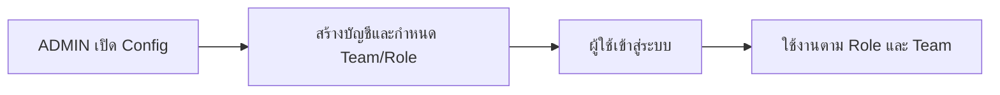
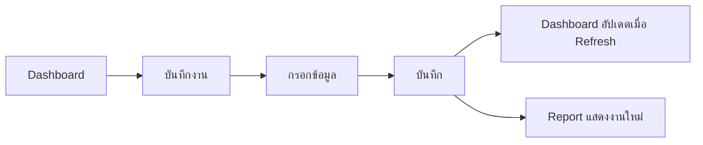
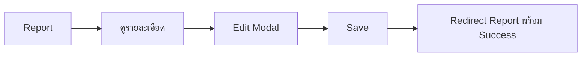
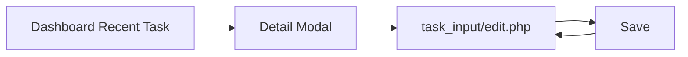

# IT / AV Task Management System — UX/UI Guide

> เอกสาร Current-state UX/UI  
> ตรวจสอบจาก HTML, CSS และ JavaScript ณ วันที่ 14 สิงหาคม 2569  
> เอกสารนี้อธิบายหน้าจอที่มีอยู่ ไม่ใช่ Final Redesign Specification

## 1. จุดประสงค์

เอกสารนี้ทำให้ผู้ออกแบบและ AI Assistant เห็นภาพว่าแต่ละหน้ามีโครงสร้าง องค์ประกอบ การตอบสนอง และ Flow อย่างไร เพื่อให้การออกแบบใหม่ยังรักษาฟังก์ชันและความคุ้นเคยของผู้ใช้เดิม

เอกสารที่เกี่ยวข้อง:

- [`SYSTEM_OVERVIEW.md`](SYSTEM_OVERVIEW.md)
- [`DATABASE_REFERENCE.md`](DATABASE_REFERENCE.md)
- [`SECURITY_AND_PERMISSIONS.md`](SECURITY_AND_PERMISSIONS.md)

## 2. Current Design Language

### 2.1 บุคลิกของระบบ

- Enterprise Internal System
- โทนเข้มสำหรับ Navbar/Sidebar
- พื้นหลัง Content สีเทาอมฟ้าอ่อน
- Card สีขาวหรือขาวอมเทา
- Primary action สีน้ำเงิน
- ใช้สีสถานะแบบนุ่ม ไม่สว่างจัด
- เนื้อหาหลักภาษาไทย แต่ชื่อระบบและเมนูบางส่วนภาษาอังกฤษ

### 2.2 สีหลักที่ตรวจพบ

| Token เชิงความหมาย | ค่าสีหลัก | การใช้งาน |
|---|---|---|
| Navy | `#0f172a` | Sidebar, Heading |
| Navbar dark | `#111827` | Navbar |
| Dark layer | `#0b1220` | Gradient/Navbar/Sidebar |
| Slate | `#1e293b` | Hover/Active Sidebar |
| Primary blue | `#1769c2` | Button, Icon, Focus |
| Page background | `#eef2f7` | Main Content Background |
| Card background | `#fbfcfe`, `#ffffff` | Cards |
| Border | `#d9e3ee`, `#cbd8e6` | Card/Form Border |
| Muted text | `#66788a`, `#718096` | Subtitle, Helper text |
| Pending | เหลือง/น้ำตาลอ่อน | Pending badge/icon |
| In progress | ม่วงอ่อน | In Progress badge/icon |
| Completed | เขียวอ่อน | Completed badge/icon |
| Danger | แดง Bootstrap | Error/Delete/Logout |

สี Status โดยประมาณ:

```text
Pending      text #9a640d / background #fff1cc
In Progress  text #5142a5 / background #e9e4ff
Completed    text #17734f / background #dff5e9
Cancelled    text #b42318 / background #feecee
```

### 2.3 Font

CSS ระบุ:

```css
font-family: "Poppins", "Inter", "Segoe UI", sans-serif;
```

แต่ไม่มีการโหลด Poppins หรือ Inter จากภายนอก จึงมักแสดงด้วย Segoe UI บน Windows

### 2.4 รูปทรงและเงา

- Card radius ประมาณ `.9rem`
- Form control radius ประมาณ `.55rem`
- Modal radius ประมาณ `1rem`
- Shadow Card ประมาณ `0 8px 24px rgba(26,57,89,.10)`
- Navbar/Sidebar ใช้ Shadow เข้มกว่าส่วนเนื้อหา
- Section icon เป็นสี่เหลี่ยมมุมมนพร้อมพื้นหลังสีอ่อน

## 3. Global Application Layout

### 3.1 Desktop

```text
┌────────────────────────────────────────────────────────────────────┐
│ [Logo] IT / AV Task Management System       [Avatar Name Role] [ออก]│
├──────────────────┬─────────────────────────────────────────────────┤
│ MAIN MENU        │ Page title                                      │
│ Dashboard        │ Subtitle                                        │
│ บันทึกงาน        │                                                 │
│ รายงาน           │ Cards / Form / Table / Charts                  │
│                  │                                                 │
│ SYSTEM           │                                                 │
│ Config           │                                                 │
│                  │                                                 │
│              [?] │                                                 │
└──────────────────┴─────────────────────────────────────────────────┘
```

- Navbar fixed ด้านบน สูง 72px
- Sidebar fixed ด้านซ้าย กว้าง 260px
- Main content เริ่มหลัง Navbar และ Sidebar
- Sidebar scroll แยกจากหน้า
- ไอคอนคู่มืออยู่มุมล่างขวาของ Sidebar
- Hover ไอคอนคู่มือแล้วแสดงคำว่า “คู่มือ”

### 3.2 Mobile

```text
┌──────────────────────────────────────┐
│ [☰] [Logo] System Title        [👤][ออก]│
├──────────────────────────────────────┤
│ Page title                           │
│                                     │
│ Content stacked vertically          │
│                                     │
└──────────────────────────────────────┘

กด ☰:
┌─────────────────────┐
│ Navigation       [x]│
│ Dashboard           │
│ บันทึกงาน           │
│ รายงาน              │
│ Config              │
│                   ? │
└─────────────────────┘
```

- Navbar สูง 64px
- Sidebar เป็น Bootstrap Offcanvas
- ซ่อน Username/Role บางส่วนด้วย `.hide-mobile`
- Grid Card เปลี่ยนเป็น 1–2 คอลัมน์ตามขนาด
- Tables ใช้ Horizontal Scroll

## 4. Shared Navbar

องค์ประกอบ:

1. Mobile menu button
2. Brand icon
3. `IT / AV Task Management System`
4. Profile link
5. Profile avatar หรือรูปที่ Upload
6. Username
7. Role badge
8. Logout button

ปัจจุบัน Role badge แสดง `USER`, `SUPER` หรือ `ADMIN` ไม่ใช่ชื่อทีม

ความไม่สอดคล้อง:

- Dashboard มี Navbar copy ของตัวเอง
- หน้าอื่นใช้ `includes/app_header.php`
- หากปรับ Navbar ใน Shared Header อย่างเดียว Dashboard อาจไม่เปลี่ยนตาม
- ข้อกำหนดล่าสุดที่ต้องแสดง Team แทน Role ยังไม่ถูกใช้ในโค้ดปัจจุบัน

## 5. Shared Sidebar

เมนู:

```text
MAIN MENU
Dashboard
บันทึกงาน
รายงาน

SYSTEM
Config

ไอคอนคู่มือด้านล่าง
```

Active state:

- บันทึกงาน, รายงาน และ Config ใช้ตัวแปร `$active_nav`
- Dashboard ใน Shared Sidebar ไม่มี Logic เติม `active`
- Dashboard ใช้ Sidebar ของตัวเองและกำหนด active โดยตรง
- Help เติม Active state ด้วย JavaScript

Footer JavaScript:

- ลบเมนู “คู่มือ” แบบปกติออก
- สร้างลิงก์ไอคอน `?` ใหม่ที่ด้านล่าง
- Hover แล้วแสดงคำว่า “คู่มือ”

## 6. Shared Form Components

### 6.1 Form Control

- ความสูงอย่างน้อย 44px
- Border สีเทาอมฟ้า
- Focus เป็นกรอบสีน้ำเงินอ่อน
- Required mark ใช้สีแดง
- Helper text อยู่ใต้ Input

### 6.2 Flatpickr

Class กลาง:

```text
.date-picker
.datetime-picker
.time-picker
```

รูปแบบแสดงผล:

```text
วันที่: 19/07/2569
วันที่และเวลา: 19/07/2569 10:18 น.
เวลา: 10:18
```

รองรับ:

- เลือกจาก Calendar
- พิมพ์เอง
- ภาษาไทย
- ปีพุทธศักราชในการแสดงผล
- เวลา 24 ชั่วโมง

ข้อสังเกต:

- ค่าในฐานข้อมูลยังเป็น Gregorian `YYYY-MM-DD HH:mm:ss`
- Validation วันที่กระจายอยู่หลายไฟล์ ไม่ได้ใช้ Parser กลางเพียงตัวเดียว

## 7. Login Page

### 7.1 Wireframe

```text
Background: Navy gradient + grid + decorative orbs

             ┌─────────────────────────────┐
             │           [🏢]              │
             │ IT / AV Task Management     │
             │ เข้าสู่ระบบเพื่อใช้งานต่อ  │
             │                             │
             │ [Alert / Countdown]         │
             │                             │
             │ ชื่อผู้ใช้งาน               │
             │ [👤 ____________________]    │
             │ รหัสผ่าน                    │
             │ [🔒 ________________ 👁]    │
             │ □ จดจำการเข้าสู่ระบบ 30 วัน│
             │ [       เข้าสู่ระบบ       ] │
             └─────────────────────────────┘

             Version / Copyright / Hotel
```

### 7.2 UX ที่มีอยู่

- Card อยู่กลางหน้า
- Show/hide password
- แจ้ง Caps Lock
- Remember Me
- Alert Login ผิดพร้อมจำนวนครั้งที่เหลือ
- Lockout Alert พร้อม Countdown `MM:SS`
- Countdown ถึงศูนย์แล้ว Refresh
- Responsive

### 7.3 Error states

- Wrong credential
- Disabled account
- Locked account
- IP rate limited
- CSRF expired

ข้อความ Disabled account บอกว่าบัญชีถูกปิดใช้งาน ซึ่งแตกต่างจากนโยบายข้อความ Login Fail แบบ Generic ที่เคยกำหนดไว้

### 7.4 UI risk

- Login card มี Hover ยก Card ขึ้นและ animation fade-in แม้แนวทางล่าสุดต้องการลด Effect ที่ไม่จำเป็น
- Bootstrap และ Icons โหลดจาก CDN จึงต้องมี Network แม้ระบบเป็น Internal System

## 8. Account Provisioning

ระบบเป็น Internal System และไม่มีหน้า Register หรือ Create Account สำหรับผู้ใช้ทั่วไป

- หน้า Login แสดงเฉพาะการเข้าสู่ระบบและ Remember Me
- `/auth/register.php` ตอบกลับ HTTP 404
- ADMIN สร้างบัญชีจาก Config และกำหนด Username, ชื่อ-นามสกุล, รหัสผ่านเริ่มต้น, Team, Role และสถานะ
- ไม่มีขั้นตอน Pending Approval หรือ View-only ก่อนอนุมัติ
- บัญชีที่เปิดใช้งานสามารถ Login ได้ตาม Role/Team ที่ ADMIN กำหนดไว้

## 9. Dashboard

### 9.1 โครงสร้างที่ผู้ใช้เห็น

```text
ภาพรวมแดชบอร์ด                               [🔽 Filter]
ติดตามกิจกรรมและความคืบหน้า · ทีม IT/AV/ทุกทีม

[งานทั้งหมด] [รอดำเนินการ] [กำลังดำเนินการ] [เสร็จสิ้น]

สรุปรายงาน
┌──────────────────────────┬─────────────────────────────┐
│ Donut: สัดส่วนสถานะงาน  │ Bar: สถิติจำนวนงานย้อนหลัง │
│                          │ [วัน/สัปดาห์/เดือน/ปี]      │
└──────────────────────────┴─────────────────────────────┘

┌──────────────────────────┬─────────────────────────────┐
│ ประเภทงานที่พบมาก        │ ปัญหาที่พบบ่อย             │
│ 1. Hardware ...          │ 1. ...                      │
└──────────────────────────┴─────────────────────────────┘

งานล่าสุด                                      [ดูทั้งหมด]
┌──────┬──────────┬─────────────┬─────┬────────┬─────────────┐
│ลำดับ│วันที่สร้าง│ชื่องาน      │ทีม │สถานะ  │ผู้รับผิดชอบ│
└──────┴──────────┴─────────────┴─────┴────────┴─────────────┘
[Pagination]
```

### 9.2 Filter Modal

เปิดด้วยไอคอน Funnel เพียงปุ่มเดียว มี Badge จำนวน Filter ที่ใช้งาน

ภายใน:

- Team
- Status
- Problem Category
- Start date
- End date
- Active filter chips
- จำนวนงานที่พบ
- Reset
- Cancel
- Apply

Filter ชุดเดียวมีผลกับ:

- KPI
- Charts
- Insights
- Recent Tasks

ช่วงวันที่ Dashboard อิง `start_time` ไม่ใช่ `created_at`

### 9.3 KPI

- Card สีขาว
- Icon มีสีพื้นหลังแยกตามประเภท
- Card กดได้และไป Report
- ส่ง Status และ Filter ปัจจุบันไป Report
- Keyboard Enter/Space เปิดได้
- มี Bootstrap Tooltip

### 9.4 Charts

Donut:

- Pending
- In Progress
- Completed
- ไม่แสดง Cancelled
- Tooltip แสดงจำนวนงาน

Bar chart:

- วัน: เฉพาะจันทร์–อาทิตย์ของสัปดาห์ปัจจุบัน
- สัปดาห์: ตั้งแต่งานเก่าสุดถึงปัจจุบัน
- เดือน: ตั้งแต่งานเก่าสุดถึงปัจจุบัน
- ปี: ตั้งแต่ปีของงานเก่าสุดถึงปัจจุบัน
- Label และช่วงวันที่ใช้ปี พ.ศ.
- ปิด Chart animation

### 9.5 Insights

ประเภทงานที่พบมากและปัญหาที่พบบ่อยถูกเพิ่มด้วย JavaScript หลังหน้าโหลด

Interaction:

```text
Click insight row
  → เปิด Modal
  → ตารางลำดับ / ชื่องาน / ทีม / สถานะ / วันที่สร้าง
```

### 9.6 Recent Tasks

- 5 งานต่อหน้า
- Server-side Pagination
- ทั้งแถวกดได้
- Keyboard accessible
- Modal แสดงรายละเอียด
- มีรูปประกอบเมื่อพบข้อมูล
- ปุ่มแก้ไขไปหน้า `task_input/edit.php`

### 9.7 Current UI implementation issue

Dashboard มี Markup “Summary Report” และตารางแบบเก่าใน HTML ก่อน จากนั้น JavaScript:

- สร้าง Donut + Bar layout ใหม่
- เขียนตารางงานล่าสุดใหม่
- เปลี่ยนหัวตาราง
- เพิ่ม Insight section
- สร้าง Detail Modal

ผลกระทบ:

- หาก JavaScript ไม่ทำงาน ผู้ใช้เห็น Layout และข้อความคนละชุด
- มีโอกาสเกิด Content Flicker
- การดูแลรักษายาก
- Navbar/Sidebar ซ้ำกับ Shared Layout

## 10. Task Input

### 10.1 Wireframe ปัจจุบัน

```text
บันทึกงาน
สร้างงานใหม่สำหรับทีม IT / AV อย่างรวดเร็ว

┌─ ข้อมูลงาน ────────────────────────────────────────────┐
│ ชื่องาน *                           ทีม *               │
│ สถานที่                             ชื่อผู้รับผิดชอบ    │
│ [ระบุสถานที่อื่น เมื่อเลือก Other]  สถานะ *             │
│                                                        │
│ ───── ปัญหาและการแก้ไข ─────                         │
│ ปัญหาที่พบ                         วิธีแก้ไขปัญหา       │
│                                                        │
│ สร้างเมื่อ ... ระบบบันทึกอัตโนมัติ                    │
└────────────────────────────────────────────────────────┘

┌─ ระยะเวลาการดำเนินงาน ────────────────────────────────┐
│ วันเริ่มดำเนินการ *                วันที่สิ้นสุด        │
│ เวลาเริ่มงาน *                     เวลาสิ้นสุดงาน       │
└────────────────────────────────────────────────────────┘

                              [ล้างข้อมูล] [บันทึกข้อมูล]
```

### 10.2 Natural input flow

1. ชื่องาน
2. ทีม
3. สถานที่
4. ผู้รับผิดชอบ
5. สถานะ
6. ปัญหา/วิธีแก้
7. วันและเวลา
8. บันทึก

### 10.3 Team behavior

- USER เห็น Team แบบ Readonly
- SUPER/ADMIN เห็น Team Select
- Datalist ชื่องานเปลี่ยนตาม Team
- Placeholder ชื่องานเปลี่ยนระหว่าง IT และ AV

### 10.4 Location

- เป็น `<select>`
- เลือก “อื่นๆ” แล้วแสดง Text Input
- JavaScript กำหนด Required ให้ Text Input เมื่อเลือก Other

### 10.5 Problem Choice Memory

ช่อง “ปัญหาที่พบ” เป็น Text Input เดียว แต่เมื่อ Focus จะมี Choice panel ใต้ช่อง:

```text
ปัญหาที่พบ
[พิมพ์ข้อความ_____________________]
┌──────────────────────────────────┐
│ ตัวเลือกปัญหาเดิม             [x]│
│ ตัวเลือกอีกข้อ                [x]│
└──────────────────────────────────┘
```

พฤติกรรม:

- พิมพ์ใหม่แล้ว Blur จะบันทึกเป็น Choice ของทีม
- ค้นหาตัวเลือกด้วยข้อความบางส่วน
- กดข้อความเพื่อเลือก
- กด `x` เพื่อลบ Choice
- USER จัดการเฉพาะทีมของตน
- SUPER/ADMIN จัดการตาม Team ที่เลือก
- ไม่มี Black Tooltip แล้ว

### 10.6 Status

ตัวเลือก:

- รอดำเนินการ
- กำลังดำเนินการ
- เสร็จสิ้น

หากเลือก Completed:

- JavaScript เติม Finish Date/Time หากว่าง
- Server เติมเวลาปัจจุบันหากไม่มี Finish input

### 10.7 Role state

- USER เห็นสถานะเป็นข้อมูลอ่านอย่างเดียว และ Workflow กำหนดสถานะอัตโนมัติ
- SUPER และ ADMIN เลือกสถานะได้เมื่อจำเป็น
- Permission ของงานอ้างอิง Role และ Team ไม่อ้างอิง Approval flag

### 10.8 Current mismatch

- Backend รองรับ `work_description`, `work_action`, `remark`, `category`, `task_images`
- หน้า Create ปัจจุบันไม่แสดงช่องดังกล่าว
- Backend จึงบันทึก `-` ให้ช่องที่ไม่มีใน POST
- Image Helper ถูกเรียกแต่ไม่มี File Input

## 11. Task Edit แยกหน้า

URL:

```text
task_input/edit.php?id={task_id}
```

หน้าเริ่มต้น Server-rendered มี Card:

1. ข้อมูลงาน
2. รายละเอียดงาน
3. เวลา

จากนั้น JavaScript เปลี่ยน/เพิ่ม UI:

- แยก Date และ Time
- แทรก Category
- แทรก Responsible Name
- แทรก Work Description และ Work Action
- เพิ่ม Team hint
- เพิ่ม Card รูปภาพ

หน้าดังกล่าวรองรับ:

- แก้ข้อมูลครบ
- Upload รูปเพิ่มสูงสุด 5 รูปต่อครั้ง
- แสดงรูปเดิม
- Choice Memory ของปัญหา

ข้อสังเกต:

- ไม่มี UI ลบรูปเดิม
- โครงสร้างสุดท้ายพึ่ง JavaScript มาก
- มีความซ้ำซ้อนกับ Edit Modal ใน Report
- Dashboard ยังส่งผู้ใช้มาหน้านี้ แต่ Report แก้ใน Modal

## 12. Report

### 12.1 Wireframe

```text
รายงาน / Report
ข้อมูลรายการงานจากฐานข้อมูล

[งานทั้งหมด] [รอดำเนินการ] [กำลังดำเนินการ] [เสร็จสิ้น]

┌─ รายการรายงาน ────────────────────────────────────────────────┐
│ [🔍 ค้นหาชื่องาน________] [Filter]    แสดง [10]              │
│                                      แสดง 1-10 จาก 26        │
├──────┬──────────┬──────────────┬─────┬────────┬──────────┬────┤
│ลำดับ│วันที่สร้าง│ชื่องาน       │ทีม │สถานะ  │รับผิดชอบ │Action│
├──────┼──────────┼──────────────┼─────┼────────┼──────────┼────┤
│ ...                                                         │
└───────────────────────────────────────────────────────────────┘
            [<< Previous] [1] [2] [3] [Next >>]
```

### 12.2 KPI

- คำนวณจาก Task Rows ที่ Server โหลดให้บัญชีนั้น
- ไม่เปลี่ยนตาม Client-side Filter
- สี Card ขาว
- Icon พื้นหลังสีตามประเภทเหมือน Dashboard

### 12.3 Search

- `<input type="search">`
- Placeholder “ค้นหาชื่องาน”
- Datalist สร้างจากชื่องานจริงที่บัญชีมองเห็น
- Match แบบ `includes()` และไม่สนตัวพิมพ์ใหญ่/เล็ก
- ค้นจาก Title เท่านั้นใน Logic สุดท้าย

### 12.4 Filter Modal

- Start Date
- End Date
- Team
- Status
- Category
- Reset
- Close

Filter และ Pagination ทำงานใน Browser จาก Rows ที่โหลดมาทั้งหมด

### 12.5 Table transformation

Server HTML เริ่มต้นมี 8 คอลัมน์:

```text
รหัส / วันที่ / หัวข้องาน / แผนก / ประเภทปัญหา / สถานะ / ผู้สร้าง / การจัดการ
```

JavaScript เปลี่ยนเป็น:

```text
ลำดับ / วันที่สร้าง / ชื่องาน / ทีม / สถานะ / ผู้รับผิดชอบ / การจัดการ
```

และลบ Category column หลังหน้าโหลด

หาก JavaScript ไม่ทำงาน ตารางจะกลับไปแสดงหัวแบบเก่า

### 12.6 Detail Modal

```text
┌──────────────────────────────────────────────────────────┐
│ รายละเอียดงาน: {ชื่องาน}                             [x]│
├──────────────────────────────────────────────────────────┤
│ [ชื่องาน]          [ทีม]              [สถานะ]           │
│ [ประเภทปัญหา]      [สถานที่]                            │
│ [รายละเอียดงาน]                                          │
│ [การดำเนินงาน]                                           │
│ [ปัญหาที่พบ]       [วิธีแก้ไขปัญหา]                    │
│ [วัน/เวลาเริ่ม]    [วัน/เวลาสิ้นสุด]                    │
│ [หมายเหตุ]                                               │
│ [รูปภาพ]                                                 │
│ [ผู้รับผิดชอบ]    [สร้างเมื่อ] [อัปเดตเมื่อ]            │
├──────────────────────────────────────────────────────────┤
│                            [แก้ไขงาน] [ปิด]              │
└──────────────────────────────────────────────────────────┘
```

Styling:

- Header ฟ้าเทาอิ่มขึ้น
- Body เทาอมฟ้า
- แต่ละข้อมูลอยู่ในกรอบ
- Border ซ้ายสีน้ำเงิน
- Footer สีฟ้าเทา

### 12.7 Edit Modal

Section:

1. ข้อมูลงาน
2. รายละเอียดและการดำเนินงาน
3. ระยะเวลาการดำเนินงาน

ฟิลด์:

- ชื่องาน
- ทีม
- ผู้รับผิดชอบ
- สถานที่
- สถานะ
- ประเภทปัญหา
- รายละเอียดงาน
- การดำเนินงาน
- ปัญหาที่พบ
- วิธีแก้ไขปัญหา
- หมายเหตุ
- วัน/เวลาเริ่ม
- วัน/เวลาสิ้นสุด

Known defect:

- `.modal-content` มี `<form>` คั่นก่อน `.modal-body`
- Bootstrap `modal-dialog-scrollable` จึงไม่ควบคุม Scroll ของ Body ตามที่คาด
- Modal แก้ไขอาจเลื่อนไม่ได้เมื่อเนื้อหาสูงกว่าหน้าจอ

### 12.8 Scalability concern

ต่อ Task หนึ่งรายการ Server สร้าง:

- 1 Table row
- 1 Detail Modal
- 1 Delete Modal หากลบได้

และ Task ทั้งหมดถูกส่งเข้า JavaScript อีกครั้งสำหรับ Edit Modal

เมื่อข้อมูลเพิ่มมาก:

- HTML ใหญ่
- Initial load ช้า
- Memory ใน Browser สูง
- Client-side Pagination ไม่ลด Query/Transfer

## 13. Config

### 13.1 Wireframe ปัจจุบัน

```text
ตั้งค่าบัญชี / ตั้งค่าระบบ

┌─ เปลี่ยนรหัสผ่านของฉัน ───────────────────────────────────┐
│ รหัสผ่านเดิม | รหัสผ่านใหม่ | ยืนยันรหัสผ่านใหม่          │
└─────────────────────────────────────────────────────────────┘

ADMIN เท่านั้น:
┌─ จัดการผู้ใช้งาน ────────────────────── [เพิ่มผู้ใช้งาน] ┐
│ Username | ทีม | Role | Status | Created | Actions        │
└─────────────────────────────────────────────────────────────┘

┌─ ข้อมูลระบบ ───────────────────────────────────────────────┐
│ [Version] [ผู้ใช้ 5 นาทีล่าสุด] [งานทั้งหมด] [DB Connected]│
└─────────────────────────────────────────────────────────────┘
```

### 13.2 Role UX

ADMIN:

- เปลี่ยนรหัสผ่านตนเองได้
- สร้างและแก้ไขบัญชี
- Reset password
- Enable/Disable
- Delete

USER/SUPER:

- เห็นเฉพาะส่วนเปลี่ยนรหัสผ่านตนเอง
- ไม่เห็นตารางผู้ใช้ ข้อมูลระบบ หรือ User Management action

### 13.3 Account status labels

- ปิดใช้งาน
- กำลังใช้งาน — เฉพาะบัญชี Session ปัจจุบัน
- พร้อมใช้งาน

จำนวนผู้ใช้งานล่าสุดในข้อมูลระบบนับจาก `last_activity_at` ภายใน 5 นาที

### 13.4 User Management modal

- Modal เพิ่มบัญชีรับ Username, ชื่อ-นามสกุล, รหัสผ่านเริ่มต้น, Team, Role และสถานะ
- Modal แก้ไขใช้ข้อมูลของบัญชีที่เลือก
- Modal Reset password แยกจากการแก้ข้อมูลทั่วไป
- Delete modal ป้องกันการลบบัญชีตนเอง และ Server ปฏิเสธบัญชีที่มีประวัติงาน

## 14. Profile

### 14.1 Wireframe

```text
ข้อมูลส่วนตัว

┌─ โปรไฟล์ของฉัน ─────────────────────────────────────────┐
│ Username [readonly]   Team [readonly]   Role [readonly] │
│ ชื่อ-นามสกุล          อีเมล                              │
│ รูปโปรไฟล์ [Choose file]                                │
│ -------------------------------------------------------- │
│ เปลี่ยนรหัสผ่าน                                        │
│ ปัจจุบัน | ใหม่ | ยืนยัน                                │
│                                         [บันทึกข้อมูล]  │
└──────────────────────────────────────────────────────────┘
```

ปัจจุบัน:

- ผู้ใช้เปลี่ยนชื่อเต็ม อีเมล รูป และรหัสผ่านได้ทันที
- Username เปลี่ยนเองไม่ได้
- ไม่มีหน้า Request Approval
- ไม่มี Preview รูปก่อน Upload
- ไม่มีปุ่มลบรูปโปรไฟล์
- Navbar ใช้รูปใหม่ใน Session หลังบันทึก

## 15. Help

### 15.1 โครงสร้าง

```text
คู่มือการใช้งานระบบ

┌─ คู่มือนี้มีหน้าที่อะไร? ───────────────────────────────┐
│ Intro + Hero icon                                      │
└─────────────────────────────────────────────────────────┘

┌─ เส้นทางการใช้งาน ─────────────────────────────────────┐
│ Dashboard | บันทึกงาน | รายงาน | Config               │
└─────────────────────────────────────────────────────────┘

┌─ คู่มือแยกตามหน้า ─────────────────────────────────────┐
│ 1 Dashboard      [Accordion]                            │
│ 2 บันทึกงาน      [Accordion]                            │
│ 3 รายงาน         [Accordion]                            │
│ 4 Config          [Accordion]                            │
│ 5 คู่มือ          [Accordion]                            │
└─────────────────────────────────────────────────────────┘
```

จุดเด่น:

- อธิบายเป็นบท
- มี Shortcut ไปหน้าหลัก
- Card และ Accordion อ่านง่าย

สถานะปัจจุบัน:

- Task Input Guide แยกข้อมูลเริ่มต้นออกจากรายละเอียดที่เพิ่มภายหลังใน Task List
- Report Guide ระบุว่า USER จัดการทุกงานในทีมได้
- Config Guide อธิบายการเปลี่ยนรหัสผ่านทุก Role และ User Management เฉพาะ ADMIN
- ไม่มีเนื้อหา Public Registration หรือ Pending Approval

## 16. Localization Rules ปัจจุบัน

### คงภาษาอังกฤษ

- IT / AV Task Management System
- Dashboard
- Config
- Main Menu / System บางตำแหน่ง
- Role: USER / SUPER / ADMIN
- Category: Hardware / Software / Customer

### ภาษาไทย

- เนื้อหาหลัก
- Form labels
- Status labels
- Error/Success messages
- วันที่/เวลา
- Table headings ส่วนใหญ่

### คำศัพท์ที่ควรใช้สม่ำเสมอ

| ความหมาย | คำแนะนำ |
|---|---|
| Department | ทีม |
| Task Title | ชื่องาน |
| Created By/Owner display | ผู้รับผิดชอบ |
| Pending | รอดำเนินการ |
| In Progress | กำลังดำเนินการ |
| Completed | เสร็จสิ้น |
| Location | สถานที่ |
| Work Description | รายละเอียดงาน |
| Work Action | การดำเนินงาน |
| Problem | ปัญหาที่พบ |
| Solution | วิธีแก้ไขปัญหา |

ปัจจุบันยังพบ “แผนก”, “ผู้สร้าง”, “หัวข้องาน” และ “ประเภทปัญหา” ใน Markup เดิมก่อน JavaScript เปลี่ยน

## 17. Accessibility และ Usability

สิ่งที่ทำไว้:

- Form มี Label
- Modal มี Close button
- Dashboard rows รองรับ Keyboard
- KPI รองรับ Keyboard
- มี `aria-label` บางจุด
- ใช้สีร่วมกับข้อความ ไม่ได้ใช้สีอย่างเดียวทุกส่วน
- Responsive Grid
- Table horizontal scroll

สิ่งที่ควรปรับ:

- Active Sidebar ของ Dashboard/Help ควรมาจาก Server ไม่ใช่ JavaScript
- Focus order ใน Dynamic Modal ควรทดสอบ
- Tooltip ไม่ควรซ่อนข้อมูลสำคัญ
- Icon-only Help ควรมี Tooltip/Accessible label ที่สม่ำเสมอ
- Form error ควรผูกกับ Field ไม่ใช่ Alert รวมอย่างเดียว
- Report Client-side re-render ควรประกาศผลผ่าน `aria-live`
- Modal Edit ต้องแก้ Scroll ก่อนใช้งานจริงบน Notebook/Mobile
- Input ที่เพิ่มด้วย JavaScriptควรทำงานได้เมื่อ JavaScript ล้มเหลวหรือควร Render จาก Server

## 18. UX Flows สำคัญ

### สร้างบัญชีและเริ่มใช้งาน



### บันทึกงาน



### แก้ไขจาก Report



### แก้ไขจาก Dashboard



Flow การแก้ไข 2 แบบนี้ไม่สอดคล้องกัน

## 19. แนวทางสำหรับการออกแบบใหม่

เมื่อนำเอกสารนี้ไปออกแบบ UI ใหม่ ควรแยก:

1. สิ่งที่เป็น Business Function และต้องรักษา
2. สิ่งที่เป็น Current UI และแก้ได้
3. สิ่งที่เป็น Bug/Technical Debt และไม่ควรลอกไป

ควรรักษา:

- Navbar + Sidebar + Main Content mental model
- Team scope
- KPI 4 สถานะ
- Filter icon → Modal
- Report เป็นหน้าทำงานหลัก
- Thai date/time
- Status colors
- Existing terminology ที่ตกลงแล้ว

ไม่ควรลอกต่อ:

- Markup หนึ่งชุดแล้ว JavaScript เขียนทับอีกชุด
- สร้าง Modal ต่อทุก Row
- Client-side Pagination สำหรับข้อมูลทั้งหมด
- Dashboard layout แยกจาก Shared Layout
- Permission message ที่ไม่ตรง Backend
- Mixed labels ใน HTML แล้วค่อยเปลี่ยนด้วย JavaScript

## 20. ข้อจำกัดของการตรวจ UX/UI

- ไม่มี In-app Browser เชื่อมต่อขณะตรวจ
- ไม่ได้เก็บ Screenshot จริง
- Wireframe สร้างจาก Source ปัจจุบัน
- ไม่ได้ทดสอบ Browser matrix
- ไม่ได้ทดสอบ Screen reader จริง
- ไม่ได้เปลี่ยน CSS หรือข้อมูลเพื่อทำเอกสารนี้

